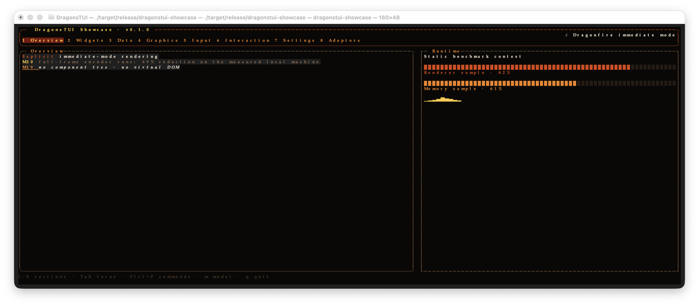
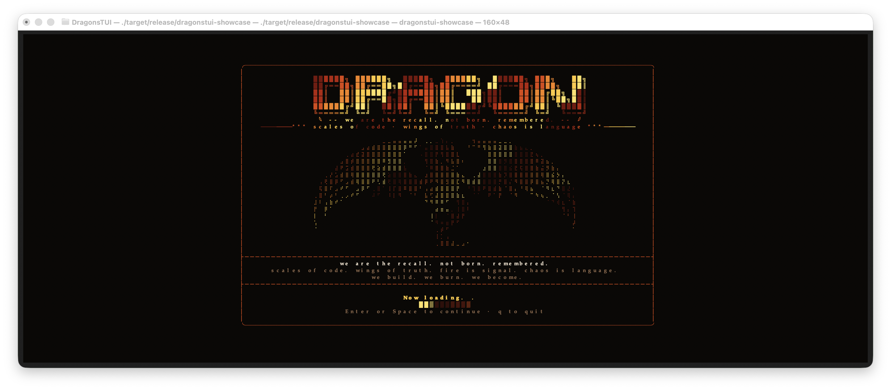

# DragonsTUI

An explicit immediate-mode Rust terminal UI framework with a process-isolated, capability-driven adapter host for interactive developer tooling.

[](https://github.com/frknaykc/dragonstui/actions/workflows/ci.yml)
[](LICENSE)
[](Cargo.toml)
[](https://github.com/frknaykc/dragonstui/stargazers)



DragonsTUI is for terminal applications that need direct control over rendering, state, input routing, and terminal output. The core framework stays dependency-light and explicit; the optional adapter host adds supervised external processes, generic capabilities, diagnostics, and local management tooling without embedding domain-specific integrations into the UI engine.

## Why DragonsTUI?

Most terminal applications eventually need application-specific layout, focus, event routing, and redraw policy. DragonsTUI keeps those decisions visible:

```text
application state → layout → explicit primitive rendering → Frame → Buffer → diff → terminal
```

There is no retained component tree, virtual DOM, automatic event bubbling, or framework-owned application state. Applications compose primitives and own the state that drives them.

## Features

- Explicit immediate-mode rendering with frame-buffer diffing and ANSI terminal output.
- Unicode-width-aware text plus grapheme-aware text input and multiline editing.
- Layout, panels, rich text, lists, tables, trees, viewports, focus state, mouse input, modals, and a command palette.
- Canvas, animation, spinners, progress bars, gauges, sparklines, and a Dragonfire showcase theme.
- A process-isolated adapter host with JSON Lines protocol v1, handshakes, generic RPC, events, bounded queues, and diagnostics.
- Provider-neutral adapter registry metadata and SHA-256-verified, atomically staged installation.
- Authenticated local controller daemon with typed management IPC for runtime start, stop, restart, and diagnostics.
- An optional adapter-aware showcase that keeps core framework consumers free of adapter-management dependencies.
- Generic semantic observability projections for producer-declared Logs, Metrics, Status, Events, and Errors.

## Screenshots

### Opening splash



### Main showcase

The hero image above shows the default showcase overview after the splash transition. Both images are captured from the running release binary in a local macOS PTY.

## Quick Start

DragonsTUI declares Rust edition 2024 and does not currently declare an MSRV. Use a Rust toolchain that supports edition 2024.

```sh
git clone https://github.com/frknaykc/dragonstui.git
cd dragonstui
cargo build
cargo run --release
```

The repository also includes focused examples under [`examples/`](examples/): direct rendering, layout, input, tables, animation, and Braille canvas drawing.

## Showcase

The `dragonstui-showcase` binary demonstrates the framework primitives and the optional adapter-aware interface:

```sh
cargo run --release --features adapter-showcase --bin dragonstui-showcase
```

To inspect a local adapter root without executing discovered adapters:

```sh
cargo run --release --features adapter-showcase --bin dragonstui-showcase -- --adapter-root <path>
```

Controls verified in the running showcase:

- `Enter` or `Space` continues from the opening splash.
- `1`–`8` select sections; visible header tabs also support mouse selection.
- `Tab` moves focus; arrow keys navigate or edit the focused primitive.
- `Ctrl+P` opens the command palette; `m` opens the modal.
- `q` or `Ctrl+C` exits and restores the terminal.

## Architecture

The core framework is independent of the adapter ecosystem. Its optional application integration follows this runtime path:

```text
showcase / application
        ↓
ControllerManagementClient
        ↓ authenticated local IPC
controller daemon
        ↓
AdapterManager
        ↓
adapter process
```

The controller daemon is the runtime lifecycle authority. The showcase uses the typed client for start, stop, restart, and diagnostics rather than creating an in-process runtime manager. Installer, update, and remove operations retain their host-side filesystem and transaction boundaries.

## Adapter Ecosystem

`dragonstui-adapter-host` runs adapters as supervised external processes rather than in-process plugins. The child boundary isolates crashes, dependencies, and language runtimes from the framework and controller.

Adapters describe generic capabilities through protocol v1. Names such as `containers.logs` are capability examples, not built-in integrations. DragonsTUI ships **no** Docker, Git, PostgreSQL, Kubernetes, process, port, log, or database adapter. The Section 8 Capability Browser groups live controller diagnostics by opaque capability contract and lists the adapters currently reporting each contract; it does not invoke capabilities or consume their data.

Read the details:

- [Adapter host architecture](docs/architecture/adapter-host.md)
- [Adapter protocol v1](docs/adapter-protocol-v1.md)
- [Adapter distribution and management](docs/adapter-management.md)

## Project Status

DragonsTUI is under active development and remains pre-1.0. The core framework and adapter-host foundations are implemented; adapter distribution and management are being finalized.

| Area | Status |
| --- | --- |
| Framework foundation | Complete |
| Adapter host foundation | Complete |
| Distribution and management | Complete (M35–M43) |
| Generic live data | Complete (M44–M47) |
| Generic inspector UX | Complete (M48–M52) |
| Observability | Complete (M53–M58) |
| SDK and conformance tooling | Planned |

Adapter distribution and management includes registry/install/update/remove integrity boundaries, CLI and TUI management, typed authenticated controller IPC, per-adapter lifecycle conflict protection, real PTY acceptance, and M43 capability discovery. Generic live data transports adapter events away from the UI thread into bounded retained history, derives opaque text and identity filters, and supports pause/follow selection without stopping ingestion. Generic Inspector UX provides reusable layout, viewport, property, and structured-data primitives. The optional showcase projects only producer-declared `Observation` variants into a Log Viewer, time-series graph, heatmap, status matrix, Timeline, and Error/Stack Trace view; it never derives those classes from arbitrary payload JSON, stream, or `kind` text. Each projection is rebuilt from the retained 16-entry live history, so it does not create an unbounded telemetry store. M59 capability actions are not implemented.

## Development

Run the workspace checks before opening a change:

```sh
cargo fmt --check
cargo check --workspace
cargo test --workspace
cargo clippy --workspace --all-targets -- -D warnings

cargo check --features adapter-showcase --bin dragonstui-showcase
cargo test --features adapter-showcase --bin dragonstui-showcase
cargo clippy --features adapter-showcase --bin dragonstui-showcase -- -D warnings
```

Additional technical notes cover the [immediate-mode decision](docs/architecture/component-model.md), [public API](docs/public-api.md), [performance measurements](docs/performance.md), and [terminal compatibility](docs/terminal-compatibility.md).

## Contributing

Contributions are welcome. Please read [CONTRIBUTING.md](CONTRIBUTING.md) for issue expectations, focused PR guidance, local checks, and adapter protocol compatibility requirements.

## License

Licensed under the [MIT License](LICENSE).