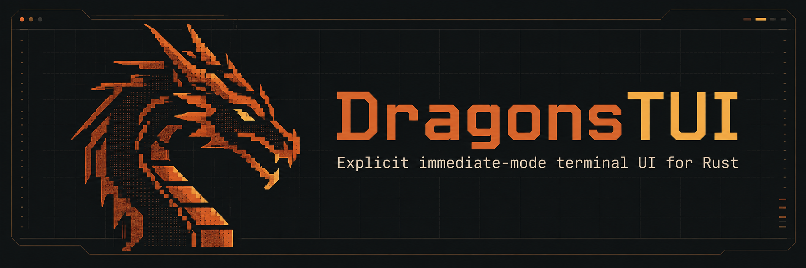
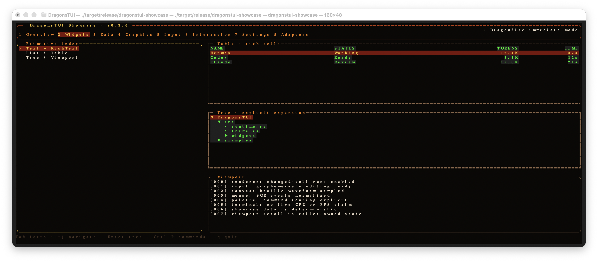

# DragonsTUI



[English](README.md) | **Türkçe**

Etkileşimli geliştirici araçları için Rust ile yazılmış, explicit immediate-mode bir terminal arayüz çatısı. İsteğe bağlı adapter host, yetenek tabanlı adapter’ları ayrı süreçlerde çalıştırır.

[](https://github.com/frknaykc/dragonstui/actions/workflows/ci.yml)
[](LICENSE)
[](Cargo.toml)
[](https://github.com/frknaykc/dragonstui/stargazers)

DragonsTUI ile çizim, uygulama durumu, girdi yönlendirme ve terminal çıktısını doğrudan kontrol edersiniz. Çekirdek az sayıda bağımlılıkla çalışır. İsteğe bağlı adapter host üzerinden süreç gözetimi, genel yetenekler, tanılama ve yerel yönetim araçları kullanabilirsiniz; alana özgü entegrasyonlar UI motorunun parçası değildir.

## Neden DragonsTUI?

Yerleşim, odak, olay yönlendirme ve yeniden çizim kararları uygulama kodunda kalır:

```text
uygulama durumu → yerleşim → açık primitive çizimi → Frame → Buffer → diff → terminal
```

Kalıcı bir bileşen ağacı, sanal DOM, otomatik olay yayılımı veya çatının yönettiği uygulama durumu yoktur. Uygulamalar çizim primitive’lerini birleştirir ve onları besleyen durumu yönetir.

## Özellikler

- Frame-buffer farkları ve ANSI çıktısıyla explicit immediate-mode çizim.
- Unicode görüntü genişliğine duyarlı metin; grapheme sınırlarını koruyan metin girişi ve çok satırlı düzenleme.
- Yerleşim, paneller, zengin metin, listeler, tablolar, ağaçlar, viewport, odak durumu, fare girdisi, modal ve komut paleti.
- Canvas, animasyon, spinner, ilerleme çubukları, göstergeler, sparkline ve Dragonfire showcase teması.
- JSON Lines protokol v1, el sıkışma, genel RPC, olaylar, sınırlı kuyruklar ve tanılama içeren, ayrı süreçlerde çalışan adapter host.
- Sağlayıcıdan bağımsız adapter registry metaverisi; SHA-256 doğrulamalı, atomik hazırlama kullanan kurulum.
- Başlatma, durdurma, yeniden başlatma ve tanılama için tipli yönetim IPC’si kullanan, kimlik doğrulamalı yerel controller daemon.
- Çekirdek kullanıcılarına adapter yönetim bağımlılıkları yüklemeyen, isteğe bağlı adapter destekli showcase.
- Üreticinin bildirdiği Logs, Metrics, Status, Events ve Errors için genel gözlemlenebilirlik görünümleri.
- Adapter uyumluluk araçları, çoklu adapter stres testleri, açık kurtarma işlemleri ve protokol/kaynak sınırları.

## Ekran görüntüleri

### Açılış ekranı


### Showcase genel görünümü


Açılış ekranından sonra Overview görünümü açılır.

### Arayüz bileşenleri



Bu ekran görüntülerini 9 Eylül 2026’da, güncel `dragonstui-showcase` release sürümünden macOS Terminal üzerinde 160 × 48 hücre boyutunda aldık. Açılış başlığının hizalama düzeltmesini içerirler. Görünümlerde canlı sağlayıcı telemetrisi değil, yerel test/demo verileri vardır. Terminal yazı tipleri ve renkleri başka sistemlerde farklı görünebilir.

## Hızlı başlangıç

Paketlenmiş binary’ler için [Kurulum ve ilk açılış](docs/installation.md) rehberiyle
başlayın: kullanıcı dizinine kurulum, ortak adapter yolları, boş ekranlar,
güncelleme ve kaldırma. Public release henüz yayımlanmadı; mevcut paketler CI artifact’larıdır.

Proje Rust edition 2024 kullanır; henüz bir minimum desteklenen Rust sürümü (MSRV) belirtmez. Edition 2024 destekleyen bir Rust araç zinciri kullanın.

```sh
git clone https://github.com/frknaykc/dragonstui.git
cd dragonstui
cargo build
cargo run --release
```

`cargo run --release`, ekran görüntülerindeki showcase yerine varsayılan dashboard’u (`dragons_tui`) başlatır. Yukarıdaki arayüz için aşağıdaki feature-gated komutu kullanın.

[`examples/`](examples/) dizininde doğrudan çizim, yerleşim, girdi, tablo, animasyon ve Braille canvas örnekleri bulunur.

## Showcase

`dragonstui-showcase`, çatının primitive’lerini ve isteğe bağlı adapter destekli arayüzü gösterir:

```sh
cargo run --release --features adapter-showcase --bin dragonstui-showcase
```

Yerel bir adapter kök dizinini, keşfedilen adapter’ları çalıştırmadan incelemek için:

```sh
cargo run --release --features adapter-showcase --bin dragonstui-showcase -- --adapter-root <path>
```

Çalışan showcase üzerinde doğrulanan kontroller:

- `Enter` veya `Space`: açılış ekranını geçer.
- `1`–`8`: bölümleri seçer; üst sekmeler fareyle seçimi de destekler.
- `Tab`: odağı taşır; yön tuşları odaktaki primitive üzerinde gezinir veya düzenleme yapar.
- `Ctrl+P`: komut paletini, `m`: modalı açar.
- `q` veya `Ctrl+C`: uygulamadan çıkar ve terminali eski durumuna döndürür.

## Mimari

Çekirdek çatı adapter ekosisteminden bağımsızdır. İsteğe bağlı uygulama entegrasyonu şu yolu izler:

```text
showcase / uygulama
        ↓
ControllerManagementClient
        ↓ kimlik doğrulamalı yerel IPC
controller daemon
        ↓
AdapterManager
        ↓
adapter süreci
```

Adapter çalışma zamanı yaşam döngüsünü controller daemon yönetir. Showcase, süreç içinde ikinci bir runtime manager oluşturmak yerine başlatma, durdurma, yeniden başlatma ve tanılama için tipli istemciyi kullanır. Kurulum, güncelleme ve kaldırma işlemleri host tarafındaki dosya sistemi ve işlem sınırlarını korur.

## Adapter ekosistemi

`dragonstui-adapter-host`, adapter’ları süreç içi eklentiler yerine gözetilen harici süreçler olarak çalıştırır. Bu ayrım, adapter çökmelerini, bağımlılıklarını ve dil çalışma zamanlarını çatıdan ve controller’dan ayırır.

Adapter’lar genel yeteneklerini protokol v1 üzerinden bildirir. `containers.logs` gibi adlar yerleşik entegrasyon değil, yetenek örnekleridir. DragonsTUI ile Docker, Git, PostgreSQL, Kubernetes, süreç, port, log veya veritabanı adapter’ı **gelmez**. Sekizinci bölümdeki Capability Browser, canlı controller tanılarını opak yetenek sözleşmesine göre gruplar ve her sözleşmeyi bildiren adapter’ları listeler; yetenek çağırmaz veya verilerini tüketmez.

Projeyle gelen **reference mock adapter**, Docker, Git veya harici servis gerektirmeden RPC, gözlemlenebilirlik, eylemler ve etkileşimli echo oturumlarını sınar. Gerçek shell veya alana özgü adapter değil, test sağlayıcısıdır. Yalıtılmış kurulum ve uçtan uca kabul adımları için [reference mock rehberine](docs/reference-mock-adapter.md) bakın.

Harici geliştiriciler, Rust/Go/Python taşınabilirlik notlarını da içeren [Adapter SDK Specification](docs/adapter-sdk-specification.md) üzerinden mevcut sözleşmeyi uygulayabilir. POSIX [Adapter Conformance Suite](docs/adapter-conformance.md) ile açıkça seçilen protokol/yaşam döngüsü senaryolarını çalıştırabilirler. Seçilmeyen kapsamlar atlandı olarak raporlanır; başarılı bir senaryo raporu sandbox, güvenlik belgesi veya tam adapter sertifikası değildir.

[Çoklu adapter stres aracı](docs/adapter-stress-testing.md), yerel mock yükü altında sınırlı olay kuyruğu taşmasını ve isteklerle eşleştirilmiş RPC yanıtlarını denetler. Release CPU/RSS ölçümleri isteğe bağlıdır.

[Çökme ve kurtarma sağlamlaştırması](docs/adapter-crash-recovery.md), sonlandırıcı hataların sınıflandırılmasını, kararlı tanılamayı, backpressure’ı ve sağlıklı adapter’ları etkilemeden açık kurtarmayı kapsar. Otomatik yeniden başlatma politikası veya genel süreç ağacı yalıtımı garantisi eklemez.

[Adapter host sınırları](docs/adapter-limits.md); protokol/manifest okumalarını, akış hızı ihlalinde sonlandırmayı, istek kabulünü, timeout ve executable path sınırlarını açıklar. Uyumluluk ve uygulama sınırları da bu belgede yer alır.

[Adapter host performansı](docs/adapter-performance.md); serialization, RPC, streaming ve scheduling için isteğe bağlı release ölçüm matrisini, yerel ham sonuçları ve ölçüm sınırlarını içerir.

[Adapter ekosistem gösterimi](docs/adapter-ecosystem-showcase.md), izole registry CLI kurulumundan gerçek TUI gözlem ve aksiyonlarına, provider çökmesine, açık yeniden başlatmaya ve diagnostics ekranına uzanan akışı; yeniden oluşturulmuş PTY kareleri ve tekrarlanabilir kabul komutlarıyla gösterir.

[Adapter yayın hazırlığı](docs/adapter-release-readiness.md); M74 kaynak denetimini, controller/CLI sınır düzeltmelerini, yerel paket doğrulamasını ve kalan yayın/platform sınırlarını kaydeder. Kamuya açık bir sürüm duyurusu değildir.

[Release paketleme](docs/release-packaging.md); v0.1.0 macOS ARM64/Linux x86_64 paketlerini, SHA-256 doğrulamasını, izole paket smoke testlerini ve tag koşullu GitHub Release akışını tanımlar. R1 sistemi yayın yapmadan hazırlayıp test eder; ilk kamuya açık sürüm R6'ya bırakılmıştır.

Ayrıntılar:

- [Adapter host mimarisi](docs/architecture/adapter-host.md)
- [Adapter protokol v1](docs/adapter-protocol-v1.md)
- [Adapter dağıtımı ve yönetimi](docs/adapter-management.md)

## Proje durumu

DragonsTUI aktif geliştirme aşamasındadır ve henüz 1.0 sürümüne ulaşmamıştır. Çekirdek çatı, adapter host temelleri, dağıtım, gözlemlenebilirlik, eylemler ve geliştirici aracı görünümleri mevcuttur. Reference mock, uyumluluk paketi ve SDK şartnamesi M68’e kadar tamamlandı; M69–M71 ile stres testleri, çökme kurtarma ve protokol/kaynak sınırları eklendi. SDK şartnamesi yayımlanmış dil SDK’ları içermez.

| Alan | Durum |
| --- | --- |
| Çatı temeli | Tamamlandı |
| Adapter host temeli | Tamamlandı |
| Dağıtım ve yönetim | Tamamlandı (M35–M43) |
| Genel canlı veri | Tamamlandı (M44–M47) |
| Genel inspector UX | Tamamlandı (M48–M52) |
| Gözlemlenebilirlik | Tamamlandı (M53–M58) |
| Adapter eylemleri | Tamamlandı (M59–M62) |
| Geliştirici aracı görünümleri | Tamamlandı (M63–M65) |
| Reference mock adapter | Tamamlandı (M66; yerel doğrulama) |
| Adapter conformance suite | Tamamlandı (M67; yerel doğrulama) |
| SDK şartnamesi | Tamamlandı (M68; yalnızca şartname, yayımlanmış dil SDK’sı yok) |
| Çoklu adapter stres testleri | Tamamlandı (M69; release ölçüm matrisi, yerel kontroller ve uzak CI başarılı) |
| Çökme ve kurtarma sağlamlaştırması | Tamamlandı (M70; yerel kurtarma regresyonları ve gerekli kontroller doğrulandı) |
| Protokol ve güvenlik sınırları | Tamamlandı (M71; yerel limit regresyonları, gerekli kontroller ve bağımsız inceleme doğrulandı) |
| Adapter host performansı | Tamamlandı (M72; release başlangıç ölçümleri, yerel kontroller ve bağımsız inceleme doğrulandı; üretim optimizasyonu iddiası yok) |

Adapter dağıtımı ve yönetimi; registry/kurulum/güncelleme/kaldırma bütünlük sınırlarını, CLI ve TUI yönetimini, tipli ve kimlik doğrulamalı controller IPC’sini, adapter bazında yaşam döngüsü çakışma korumasını, gerçek PTY kabul testlerini ve M43 yetenek keşfini kapsar.

Genel canlı veri akışı, adapter olaylarını UI iş parçacığının dışında sınırlı bir geçmişe taşır. Opak metin ve kimlik filtreleri ile veri alımını durdurmadan duraklatma/takip seçimini destekler. Genel Inspector UX, tekrar kullanılabilir yerleşim, viewport, özellik ve yapılandırılmış veri primitive’leri sunar.

İsteğe bağlı showcase, yalnızca üreticinin bildirdiği `Observation` varyantlarını Log Viewer, zaman serisi grafiği, heatmap, durum matrisi, Timeline ve Error/Stack Trace görünümlerine dönüştürür. Rastgele payload JSON, stream veya `kind` metninden bu sınıfları türetmez. Her görünüm tutulan 16 girdilik canlı geçmişten yeniden oluşur; sınırsız bir telemetri deposu oluşturmaz. M59–M60, kimlik doğrulamalı controller yolu üzerinden üreticinin bildirdiği genel eylem metaverisini ve onay politikasını ekler. Onay, yanlışlıkla eylem göndermeyi önleyen bir UI korumasıdır; izin sistemi değildir.

## Geliştirme

Değişiklik göndermeden önce çalışma alanı kontrollerini çalıştırın:

```sh
cargo fmt --check
cargo check --workspace
cargo test --workspace
cargo clippy --workspace --all-targets -- -D warnings

cargo check --features adapter-showcase --bin dragonstui-showcase
cargo test --features adapter-showcase --bin dragonstui-showcase
cargo clippy --features adapter-showcase --bin dragonstui-showcase -- -D warnings
```

Ek teknik notlar: [immediate-mode kararı](docs/architecture/component-model.md), [public API](docs/public-api.md), [performans ölçümleri](docs/performance.md) ve [terminal uyumluluğu](docs/terminal-compatibility.md).

## Katkıda bulunma

Issue beklentileri, odaklı PR kapsamı, yerel kontroller ve adapter protokol uyumluluğu gereksinimleri için [CONTRIBUTING.md](CONTRIBUTING.md) dosyasını okuyun. Bağlantılı teknik belgeler İngilizcedir.

## Lisans

[MIT Lisansı](LICENSE) ile lisanslanmıştır.
