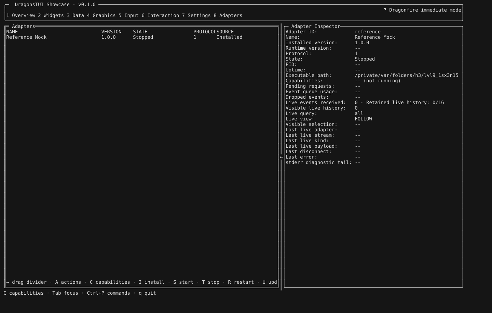
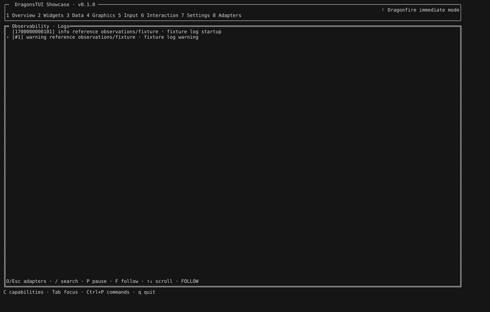
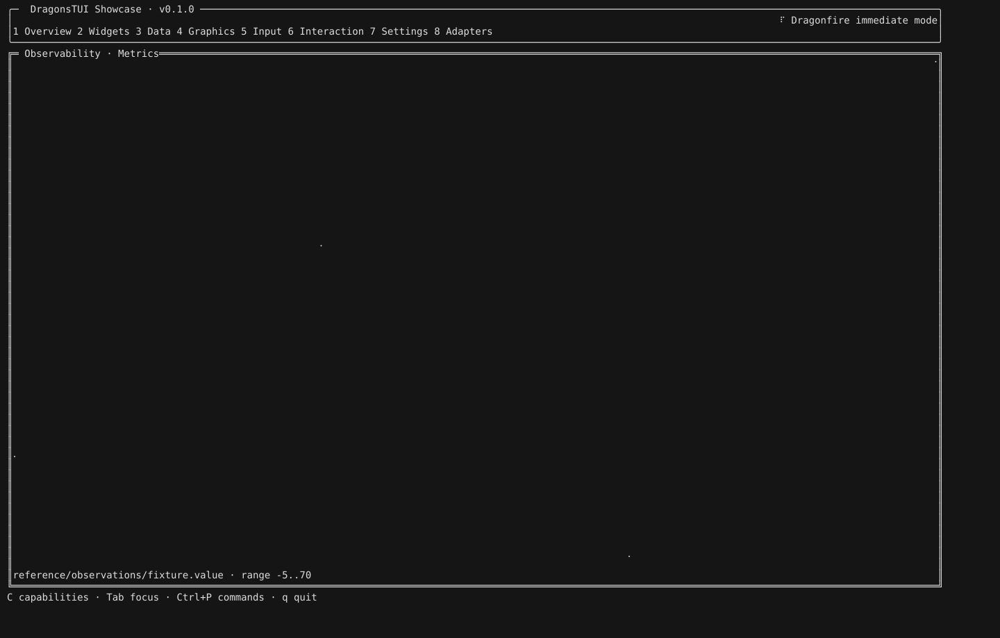
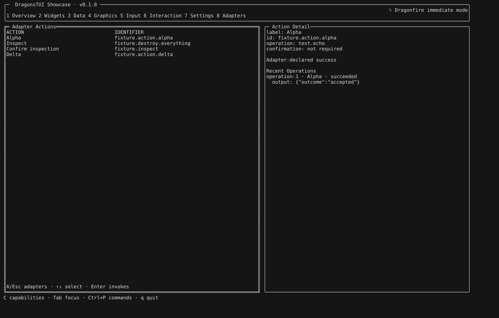
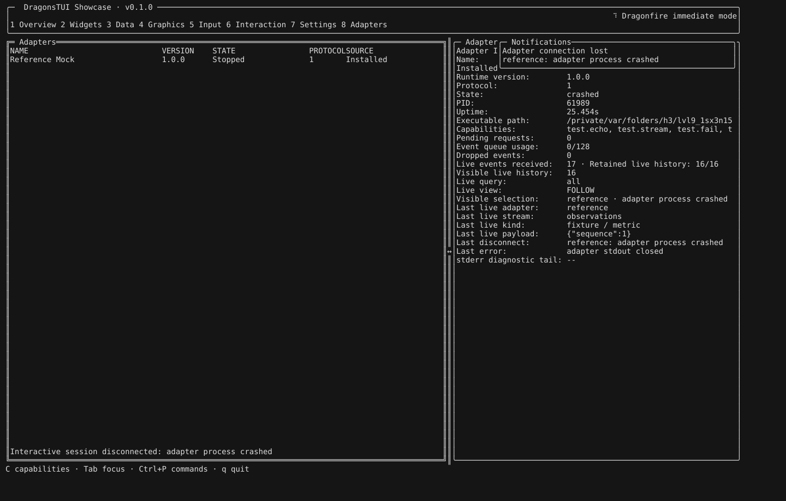
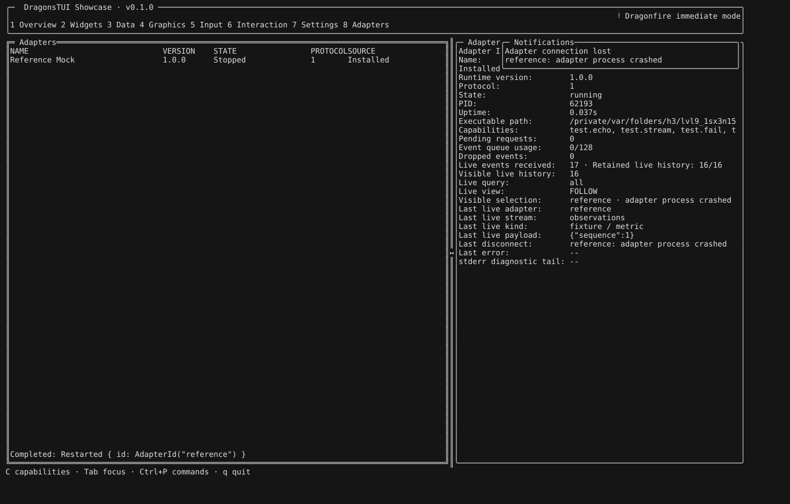

# Adapter Ecosystem Showcase (M73)

A single isolated reference provider demonstrates registry installation → start → logs → metrics → actions → provider crash → explicit restart → diagnostics. This reuses the M66 contracts; it adds no domain adapter, runtime authority, protocol envelope or automatic restart policy.

## Reproduce

From the repository root on macOS or Linux with stable Rust and Python 3.10+:

```sh
cargo build --release -p dragonstui-adapter-host --bins
cargo build --release --features adapter-showcase --bin dragonstui-showcase
python3 -m unittest discover -s tools/tests -t . -p test_ecosystem_fixture.py
python3 -m unittest discover -s tools/tests -t . -p 'test_reference_mock*.py'
python3 -m unittest discover -s tools/tests -t . -p 'test_showcase_pty_smoke.py'
python3 -m tools.acceptance.reference_mock_pty_smoke --controller target/release/dragonstui-adapter --mock target/release/dragonstui-adapter-host-mock --showcase target/release/dragonstui-showcase --ecosystem --exit q
python3 -m tools.acceptance.reference_mock_pty_smoke --controller target/release/dragonstui-adapter --mock target/release/dragonstui-adapter-host-mock --showcase target/release/dragonstui-showcase --ecosystem --exit ctrl-c
```

Each run owns a new temporary root, copied mock binary, local registry, controller daemon and PTY. It never accesses an existing adapter store or a remote registry. The JSON output contains binary hashes, passed checks and reconstructed current frames; it contains no endpoint token. Failure output retains the current frame and fixture action/session markers before cleanup.

Installation is through the **real CLI installer**, not the TUI install selector. The SHA-256-checked artifact is a POSIX launcher referencing the task-owned local mock copy. This proves the single-artifact install path, not portable packaging or publisher authenticity. Missing dispatch/session markers are a limited no-execution observation; installer tests remain authoritative for installation's no-auto-start contract.

## Recorded flow

The images below render actual reconstructed 160×55 PTY text from the successful `q` run. They are **not terminal-emulator screenshots**: colors are neutral, glyph appearance depends on the SVG viewer's monospace font, and the minimal PTY parser does not establish general Unicode/emulator compatibility. Raw frames, both run results and source/binary identities are in [the evidence record](adapter-ecosystem-evidence.json).

### 1. Installed and ready to start

The CLI installs the launcher and provenance record. The showcase discovers Reference Mock. `s` explicitly starts it through the controller; two gated observation batches reach the TUI.



### 2. Logs and metrics

`o` opens Observability. The runner checks producer-declared Log and Metric content, then Heatmap, Status, Timeline and Errors. Payload keys are not used to infer observation types.





### 3. Actions

`a` opens declared actions. The runner verifies success, rejection, cancel without dispatch, confirmed dispatch and a held operation alongside session input. Confirmation is UI policy, not authorization.



### 4. Provider crash

After the existing session tests, the runner sends the reference fixture's literal `fixture.crash-provider` through authenticated controller `input_session`. This is deterministic fixture input, not a shell command or a UI action declaration. The provider exits; the runner requires session-host dismissal, current-frame crashed state and an authoritative controller crash reason. A session-only nonzero exit is not counted as a provider crash.



### 5. Explicit restart and diagnostics

`r` requests restart through the real TUI/controller path. The runner requires the completion message, current running state, a new non-null PID and cleared last error from controller diagnostics. It then opens a new session, proving the restarted provider serves requests.



### 6. Exit and cleanup

Both `q` and Ctrl+C exit with an active session. Before daemon teardown the runner checks an empty provider session registry, restored termios and ANSI modes, and usable terminal input/output. Fixture teardown checks for process leaks. Exiting a user's normal TUI does not imply stopping an independently owned controller daemon.

## Evidence limits

- The recorded macOS runs cover `q` and Ctrl+C. The runner also accepts SIGTERM/SIGHUP; these are not fresh M73 acceptance claims.
- The reference provider is not a production service, shell, sandbox or certification of third-party adapters.
- Gate markers persist across a restart. The restarted observation burst is not claimed as a second lossless 16-event presentation; acceptance checks fresh runtime identity and a new session instead.
- Discovery rows can still say Stopped, and retained disconnect history/toasts remain visible after recovery. The runtime inspector's State/PID/Last error and authenticated controller snapshot are the restart evidence, not those historical labels.
- No production Rust source changed. Existing [management](adapter-management.md), [reference provider](reference-mock-adapter.md), [crash/recovery](adapter-crash-recovery.md) and [limits](adapter-limits.md) contracts still apply.
